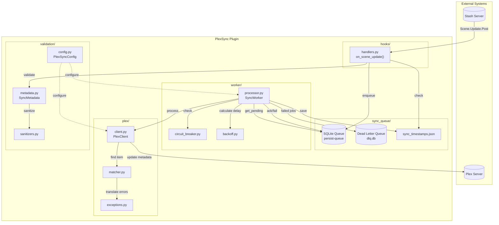

# Phase 5 Research: Architecture Documentation

**Researched:** 2026-02-03
**Domain:** PlexSync Plugin Architecture
**Confidence:** HIGH

## Summary

PlexSync is a Stash plugin that syncs scene metadata to Plex. The architecture follows a producer-consumer pattern with SQLite-backed persistent queue for reliability. The codebase is well-structured with clear module boundaries: hooks capture events, sync_queue manages persistence, worker processes jobs, plex handles API communication, and validation ensures data quality.

Key architectural decisions include: (1) SQLite queue for crash recovery, (2) circuit breaker for Plex outage resilience, (3) exponential backoff with full jitter for retry distribution, (4) confidence-based matching to handle ambiguous Plex lookups, and (5) Pydantic validation at queue ingress.

**Primary recommendation:** Document the hook-to-Plex data flow with a Mermaid diagram, covering each module's responsibility and the design rationale for queue persistence and retry strategies.

---

## Module Overview

### hooks/ - Event Capture Layer

**Purpose:** Fast (<100ms) event handlers that capture Stash events and enqueue jobs.

**Key Components:**
- `handlers.py` - Main handler logic
  - `on_scene_update()` - Entry point for Scene.Update.Post hooks
  - `requires_plex_sync()` - Filter to detect sync-worthy changes
  - `is_scan_running()` - Skip events during library scans
  - `mark_scene_pending()` / `unmark_scene_pending()` - In-memory deduplication

**Dependencies:** sync_queue.operations, validation.metadata

**Design Notes:**
- Target <100ms execution to avoid Stash hook timeouts
- Fetches full scene metadata via GraphQL (stashapi's find_scene returns minimal data)
- In-memory pending set for deduplication (acceptable tradeoff for speed)
- Validates and sanitizes metadata before enqueueing

---

### sync_queue/ - Persistence Layer

**Purpose:** SQLite-backed persistent queue with acknowledgment workflow.

**Key Components:**
- `manager.py` - QueueManager class
  - Initializes `persist-queue.SQLiteAckQueue`
  - Handles queue lifecycle (init, shutdown)

- `models.py` - SyncJob TypedDict
  - Job schema: scene_id, update_type, data, enqueued_at, job_key

- `operations.py` - Stateless queue operations
  - `enqueue()` - Add job to queue
  - `get_pending()` - Fetch next job (with timeout)
  - `ack_job()` / `nack_job()` / `fail_job()` - Acknowledgment lifecycle
  - `get_stats()` - Query SQLite for status counts
  - `load_sync_timestamps()` / `save_sync_timestamp()` - Late update detection

- `dlq.py` - DeadLetterQueue class
  - Stores permanently failed jobs with full error context
  - SQLite-backed with indexes on failed_at, scene_id
  - Retention cleanup (configurable, default 30 days)

**Dependencies:** persist-queue library

**Design Notes:**
- `auto_resume=True` recovers unacknowledged jobs on restart
- Jobs are plain dicts (no Pydantic) for safe pickling
- Sync timestamps stored in JSON file for late update detection

---

### worker/ - Processing Layer

**Purpose:** Background thread that processes queue with retry logic and circuit breaker.

**Key Components:**
- `processor.py` - SyncWorker class
  - `_worker_loop()` - Main processing loop
  - `_process_job()` - Execute sync to Plex
  - `_update_metadata()` - Apply metadata to Plex item
  - `_prepare_for_retry()` - Add backoff metadata to failed jobs
  - `_requeue_with_metadata()` - Re-enqueue with retry state

- `circuit_breaker.py` - CircuitBreaker class
  - States: CLOSED (normal), OPEN (blocking), HALF_OPEN (testing recovery)
  - Configurable: failure_threshold=5, recovery_timeout=60s

- `backoff.py` - Retry delay calculation
  - `calculate_delay()` - Exponential backoff with full jitter
  - `get_retry_params()` - Error-specific parameters (PlexNotFound gets longer delays)

**Error Classes:**
- `TransientError` - Retry-able (network, timeout, 5xx)
- `PermanentError` - Non-retry-able (auth, bad request)

**Dependencies:** sync_queue, plex, hooks.handlers

**Design Notes:**
- Daemon thread dies with main process
- Retry state stored in job dict (crash-safe)
- PlexNotFound uses longer delays (30s base, 12 retries, ~2hr window) for library scanning
- Standard errors: 5s base, 5 retries

---

### plex/ - API Client Layer

**Purpose:** Plex server communication with retry and exception translation.

**Key Components:**
- `client.py` - PlexClient wrapper
  - Lazy PlexServer initialization
  - Tenacity retry on connection errors (3 attempts, exponential backoff)
  - Configurable timeouts (connect: 5s, read: 30s)

- `matcher.py` - Item lookup logic
  - `find_plex_items_with_confidence()` - Main matcher
  - Fast path: title search derived from filename
  - Slow fallback: scan all items if title search fails
  - Returns MatchConfidence (HIGH/LOW) and candidate list

- `exceptions.py` - Exception hierarchy
  - `PlexTemporaryError` - Retry-able
  - `PlexPermanentError` - Non-retry-able
  - `PlexNotFound` - Item not in library (transient, may appear after scan)
  - `translate_plex_exception()` - Convert plexapi/requests errors

- `device_identity.py` - Persistent device ID
  - Prevents "new device connected" notifications
  - Must be called before any PlexServer connections

**Dependencies:** plexapi, tenacity, requests

**Design Notes:**
- Exception translation ensures consistent error handling
- Matcher uses two-phase search (fast title, slow scan fallback)
- Device identity persisted to avoid Plex notification spam

---

### validation/ - Data Quality Layer

**Purpose:** Pydantic-based validation and sanitization for metadata.

**Key Components:**
- `metadata.py` - SyncMetadata model
  - Required: scene_id (int), title (str)
  - Optional: details, date, rating100, studio, performers, tags
  - Field validators apply sanitization

- `sanitizers.py` - Text cleaning
  - `sanitize_for_plex()` - Remove control chars, normalize quotes, truncate

- `config.py` - PlexSyncConfig model
  - Required: plex_url, plex_token
  - Optional tunables: enabled, max_retries, poll_interval, timeouts, etc.
  - `validate_config()` - Returns (config, error) tuple

**Dependencies:** pydantic

**Design Notes:**
- Validation at queue ingress prevents bad data from entering system
- Config validation fails fast on startup

---

## Data Flow

### Step 1: Event Capture (hooks/)

```
Stash Scene.Update.Post hook fires
        |
        v
PlexSync.py main() reads JSON from stdin
        |
        v
handle_hook() extracts hookContext
        |
        v
on_scene_update() called with scene_id, update_data
```

### Step 2: Event Filtering (hooks/)

```
on_scene_update()
        |
        v
is_scan_running()? --> Yes --> Skip (scan in progress)
        |
        No
        v
requires_plex_sync()? --> No --> Skip (no metadata fields)
        |
        Yes
        v
sync_timestamps check --> Already synced --> Skip
        |
        Not synced
        v
is_scene_pending()? --> Yes --> Skip (already queued)
```

### Step 3: Metadata Fetch & Validation (hooks/, validation/)

```
Fetch full scene via GraphQL
        |
        v
Extract: title, details, date, studio, performers, tags, poster_url
        |
        v
validate_metadata() with Pydantic
        |
        v
sanitize_for_plex() cleans text fields
        |
        v
enqueue() adds job to SQLite queue
        |
        v
mark_scene_pending() for deduplication
```

### Step 4: Background Processing (worker/)

```
SyncWorker._worker_loop() (daemon thread)
        |
        v
circuit_breaker.can_execute()? --> No --> Sleep, retry later
        |
        Yes
        v
get_pending() from SQLite queue
        |
        v
_is_ready_for_retry()? --> No --> nack_job(), continue
        |
        Yes
        v
_process_job() called
```

### Step 5: Plex Matching (plex/)

```
_process_job()
        |
        v
PlexClient.server (lazy connect with retry)
        |
        v
Get library section(s) to search
        |
        v
find_plex_items_with_confidence()
        |
        +-- Fast path: title search derived from filename
        |
        +-- Slow fallback: scan all items
        |
        v
MatchConfidence scoring
        |
        +-- HIGH (1 match) --> Proceed to update
        |
        +-- LOW (multiple) --> strict_matching? Skip or warn
        |
        +-- None --> raise PlexNotFound (retry later)
```

### Step 6: Metadata Update (worker/, plex/)

```
_update_metadata()
        |
        v
Map fields: title, studio, details->summary, date
        |
        v
preserve_plex_edits? --> Only update empty fields
        |
        v
plex_item.edit(**edits)
        |
        v
Sync performers as actors
        |
        v
Sync tags as genres
        |
        v
Add to studio collection
        |
        v
Upload poster/background images (fetch from Stash first)
```

### Step 7: Job Completion (worker/, sync_queue/)

```
Success:
        ack_job() --> Job removed from queue
        circuit_breaker.record_success()
        save_sync_timestamp()
        unmark_scene_pending()

TransientError:
        circuit_breaker.record_failure()
        _prepare_for_retry() --> Add backoff metadata
        retry_count < max_retries?
                Yes --> _requeue_with_metadata()
                No --> fail_job() + dlq.add()

PermanentError:
        fail_job() + dlq.add() immediately
```

---

## Design Decisions

### Why SQLite Queue (persist-queue)?

**Problem:** Plugin may timeout during Plex sync; need to resume later.

**Decision:** Use `persist-queue.SQLiteAckQueue` with `auto_resume=True`.

**Rationale:**
- Jobs survive process crashes and Stash plugin timeouts
- Acknowledgment workflow (ack/nack/fail) ensures exactly-once processing
- SQLite is lightweight, no external dependencies
- Queue statistics queryable for monitoring

**Alternative considered:** In-memory queue - rejected due to data loss on crash.

---

### Why Circuit Breaker?

**Problem:** During Plex outages, retries exhaust quickly, filling DLQ.

**Decision:** Implement circuit breaker pattern with 3 states.

**Rationale:**
- OPEN state pauses all processing during outage
- Recovery timeout (60s) prevents retry storm
- HALF_OPEN allows test request before full recovery
- Failure threshold (5) prevents single-failure trips

**Configuration:** failure_threshold=5, recovery_timeout=60s, success_threshold=1

---

### Why Exponential Backoff with Full Jitter?

**Problem:** Multiple jobs retrying simultaneously after outage (thundering herd).

**Decision:** `random.uniform(0, min(cap, base * 2^retry))` for retry delays.

**Rationale:**
- Full jitter distributes retries randomly within delay window
- Prevents synchronized retry storms
- Cap prevents unbounded delays
- Crash-safe: retry metadata stored in job dict, not worker state

**Parameters:**
- Standard errors: base=5s, cap=80s, max_retries=5
- PlexNotFound: base=30s, cap=600s, max_retries=12 (~2hr window for library scans)

---

### Why Confidence-Based Matching?

**Problem:** Filename matching can find multiple Plex items (duplicates, similar names).

**Decision:** Return MatchConfidence (HIGH/LOW) and let caller decide.

**Rationale:**
- HIGH confidence (single match): Safe to auto-sync
- LOW confidence (multiple): configurable via `strict_matching`
- Avoids updating wrong item silently
- Logged warnings help troubleshoot matching issues

**Configuration:** `strict_matching=true` (default) skips ambiguous matches.

---

### Why Validate at Queue Ingress?

**Problem:** Bad data entering queue causes repeated processing failures.

**Decision:** Pydantic validation in hook handler before enqueue.

**Rationale:**
- Fail fast: catch issues before they enter the system
- Sanitization: clean control chars, normalize quotes
- Schema enforcement: required fields (scene_id, title) checked upfront
- Graceful handling: validation errors logged, job not enqueued

---

### Why Two-Phase Plex Matching?

**Problem:** Full library scan is slow but title search may miss items.

**Decision:** Fast path (title search) then slow fallback (scan all).

**Rationale:**
- Title derived from filename usually works
- Fallback handles edge cases (renamed items, odd filenames)
- Performance: most syncs use fast path
- Reliability: slow path ensures eventual match

---

## External Resources

### Stash Plugin System
- [Stash Plugin Documentation](https://docs.stashapp.cc/plugins/)
- [stashapi PyPI](https://pypi.org/project/stashapi/)

**Key concepts:**
- Plugins receive JSON on stdin, return JSON on stdout
- Hooks triggered by Stash events (Scene.Update.Post, etc.)
- Tasks triggered manually from UI
- Settings defined in PlexSync.yml

### Plex API
- [plexapi Documentation](https://python-plexapi.readthedocs.io/)
- [Plex API Overview](https://support.plex.tv/articles/201638786-plex-media-server-url-commands/)

**Key concepts:**
- Libraries contain sections (Movies, TV Shows, etc.)
- Items have media -> parts -> files
- Metadata editable via `item.edit()`
- Authentication via X-Plex-Token header

### Libraries Used
- [persist-queue](https://pypi.org/project/persist-queue/) - SQLite-backed persistent queue
- [plexapi](https://pypi.org/project/plexapi/) - Python Plex API client
- [tenacity](https://pypi.org/project/tenacity/) - Retry library
- [pydantic](https://docs.pydantic.dev/) - Data validation

---

## Dev Setup

### Requirements

**Runtime dependencies (`requirements.txt`):**
```
persist-queue>=1.1.0
stashapi
plexapi>=4.17.0
tenacity>=9.0.0
pydantic>=2.0.0
```

**Development dependencies (`requirements-dev.txt`):**
```
pytest>=9.0.0
pytest-mock>=3.14.0
pytest-cov>=6.0.0
freezegun>=1.4.0
pytest-timeout>=2.3.0
```

### Running Tests

```bash
# Install dev dependencies
pip install -r requirements.txt
pip install -r requirements-dev.txt

# Run tests with coverage
pytest

# Run specific test file
pytest tests/test_circuit_breaker.py

# Skip slow tests
pytest -m "not slow"
```

**Coverage requirement:** 80% minimum (configured in pytest.ini)

### Code Style

**Note:** No pre-configured formatters (black, ruff) found in the project. Tests and existing code follow standard Python conventions.

### Project Structure

```
PlexSync/
    PlexSync.py          # Main entry point
    PlexSync.yml         # Stash plugin manifest
    process_queue.py     # Manual queue processor utility
    hooks/
        __init__.py
        handlers.py      # Event handlers
    sync_queue/
        __init__.py
        manager.py       # QueueManager
        models.py        # SyncJob TypedDict
        operations.py    # Queue operations
        dlq.py           # Dead letter queue
    worker/
        __init__.py
        processor.py     # SyncWorker
        circuit_breaker.py
        backoff.py
    plex/
        __init__.py
        client.py        # PlexClient
        matcher.py       # Item matching
        exceptions.py    # Exception hierarchy
        device_identity.py
    validation/
        __init__.py
        metadata.py      # SyncMetadata model
        sanitizers.py    # Text cleaning
        config.py        # PlexSyncConfig
    tests/
        ...
    docs/
        config.md
        install.md
        troubleshoot.md
```

---

## Mermaid Diagram Sketch



---

## Confidence Assessment

| Area | Level | Reason |
|------|-------|--------|
| Module structure | HIGH | Direct code inspection |
| Data flow | HIGH | Traced through all files |
| Design decisions | HIGH | Inferred from code patterns and comments |
| External resources | MEDIUM | Links based on code imports, not verified |

---

## Sources

### Primary (HIGH confidence)
- Direct code inspection of all Python modules
- requirements.txt and requirements-dev.txt
- pytest.ini configuration
- PlexSync.yml plugin manifest

### Secondary (MEDIUM confidence)
- External library documentation (plexapi, persist-queue, pydantic)
- Stash plugin documentation

---

*Phase: 05-architecture-documentation*
*Research completed: 2026-02-03*
