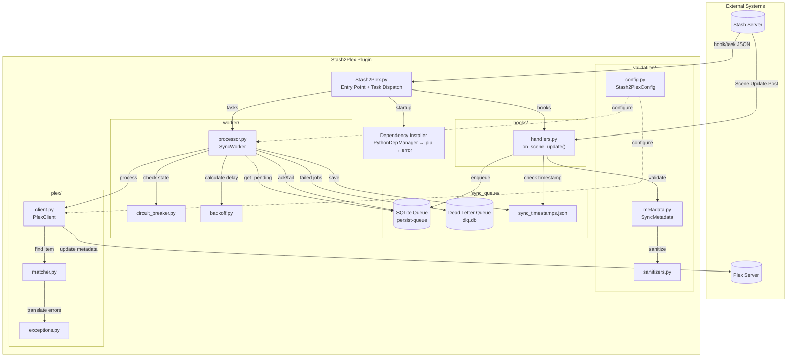

# Stash2Plex Architecture

Stash2Plex is a Stash plugin that automatically syncs scene metadata to Plex Media Server. It uses a producer-consumer pattern with a SQLite-backed persistent queue to ensure reliable delivery even through process crashes, timeouts, and network outages.

**External Documentation:**
- [Stash Plugin System](https://docs.stashapp.cc/plugins/)
- [plexapi Documentation](https://python-plexapi.readthedocs.io/)

---

## System Diagram

---

## Module Overview

### Stash2Plex.py - Entry Point

**Purpose:** Plugin entry point, dependency installation, infrastructure initialization, and task/hook dispatch.

**Responsibilities:**
- Install dependencies via three-step fallback: PythonDepManager → pip subprocess (with `--break-system-packages` for PEP 668) → actionable error
- Parse `requirements.txt` as the single source of truth for dependencies
- Read JSON input from stdin (Stash plugin protocol)
- Initialize queue infrastructure, worker, and configuration on first call
- Route to hook handlers (Scene.Update.Post, Scene.Create.Post) or task handlers (sync all, queue status, process queue, etc.)

**Tasks handled:**
- `all` / `recent` - Bulk sync scenes to Plex (skips scenes already synced since last update)
- `queue_status` - View pending and DLQ counts
- `clear_queue` / `clear_dlq` / `purge_dlq` - Queue management
- `process_queue` - Foreground processing until empty (no timeout)

**Design Note:** Dependencies are parsed from `requirements.txt` with a small override map for packages where import names differ from pip names. This avoids hardcoding the dependency list in multiple places.

---

### hooks/ - Event Capture Layer

**Purpose:** Capture Stash events and enqueue sync jobs with minimal latency.

**Key Files:**
- `handlers.py` - Main event handler logic

**Responsibilities:**
- Receive `Scene.Update.Post` hook events from Stash
- Filter events: skip library scans, duplicate events, unchanged metadata
- Fetch full scene metadata via GraphQL (hook payload is minimal)
- Validate and enqueue jobs for background processing

**Design Note:** Target <100ms execution to avoid Stash hook timeouts. Uses in-memory pending set for deduplication rather than database lookups.

---

### sync_queue/ - Persistence Layer

**Purpose:** Provide crash-safe job storage with acknowledgment-based processing.

**Key Files:**
- `manager.py` - QueueManager class (lifecycle management)
- `models.py` - SyncJob TypedDict (job schema)
- `operations.py` - Stateless queue operations (enqueue, get_pending, ack/nack/fail)
- `dlq.py` - DeadLetterQueue for permanently failed jobs

**Responsibilities:**
- Store jobs in SQLite via `persist-queue.SQLiteAckQueue`
- Track sync timestamps to detect late/stale updates
- Route permanently failed jobs to dead letter queue with error context
- Provide queue statistics for monitoring

**Design Note:** Jobs are plain dicts (not Pydantic models) to ensure safe pickling. `auto_resume=True` recovers unacknowledged jobs on process restart.

---

### worker/ - Processing Layer

**Purpose:** Background thread that processes queue with retry logic and circuit breaker protection.

**Key Files:**
- `processor.py` - SyncWorker class (main processing loop)
- `circuit_breaker.py` - CircuitBreaker (CLOSED/OPEN/HALF_OPEN states)
- `backoff.py` - Exponential backoff calculator with full jitter

**Responsibilities:**
- Poll queue for pending jobs in daemon thread
- Check circuit breaker before processing (pause during Plex outages)
- Compare metadata against current Plex values before writing (skip no-op updates)
- Execute sync to Plex with deferred reload (single HTTP roundtrip instead of per-field)
- Calculate retry delays and requeue failed jobs with backoff metadata
- Track cumulative sync statistics to disk

**Design Note:** Retry state (count, next_retry_at) stored in job dict, not worker state. This makes retries crash-safe - unacknowledged jobs resume with correct backoff after restart. A 150ms inter-job pause prevents overwhelming Plex during bulk sync.

---

### plex/ - API Client Layer

**Purpose:** Communicate with Plex server with retry logic and consistent error handling.

**Key Files:**
- `client.py` - PlexClient wrapper (lazy initialization, timeouts)
- `matcher.py` - Item lookup with confidence scoring
- `exceptions.py` - Exception hierarchy and translation
- `device_identity.py` - Persistent device ID for Plex

**Responsibilities:**
- Initialize PlexServer connection with configurable timeouts and connection pooling
- Find Plex items by filename matching (fast title search, slow fallback)
- Return match confidence (HIGH/LOW) for caller decision
- Translate plexapi/requests exceptions to Stash2Plex error types

**Design Note:** Two-phase matching strategy - fast path searches by title derived from filename, slow fallback scans all items. Most syncs hit fast path; fallback handles edge cases. A shared `requests.Session` provides HTTP connection pooling/keep-alive across all Plex API calls.

---

### validation/ - Data Quality Layer

**Purpose:** Validate and sanitize metadata before it enters the queue.

**Key Files:**
- `metadata.py` - SyncMetadata Pydantic model
- `sanitizers.py` - Text cleaning functions
- `config.py` - Stash2PlexConfig model with validation

**Responsibilities:**
- Enforce required fields (scene_id, title) via Pydantic
- Sanitize text: remove control characters, normalize quotes, truncate
- Validate plugin configuration at startup
- Fail fast on invalid data before queue ingress

**Design Note:** Validation at queue ingress prevents bad data from causing repeated processing failures. Invalid metadata is logged and rejected immediately.

---

## Data Flow

### 0. Startup and Dependency Installation

On each invocation, `Stash2Plex.py` ensures all Python dependencies are available. It parses `requirements.txt`, tries PythonDepManager first, falls back to pip subprocess (using `sys.executable` to target Stash's own Python, with `--break-system-packages` for PEP 668 compatibility on Alpine/Debian 12+/Ubuntu 23.04+), and exits with an actionable error if both fail. This three-step approach handles Docker environments where `pip install` from a terminal targets a different Python.

### 1. Event Capture

When a scene is updated in Stash, it fires a `Scene.Update.Post` hook (or `Scene.Create.Post` for new scenes). Stash2Plex receives the hook payload via stdin JSON and routes it to `on_scene_update()`. For `Scene.Create.Post` events with `trigger_plex_scan` enabled, a Plex library scan is triggered first to ensure Plex discovers the new file.

### 2. Event Filtering

Before processing, multiple filters apply:
- **Scan check:** Skip if Stash library scan is running (bulk imports)
- **Sync check:** Skip if no syncable fields changed (title, details, date, etc.)
- **Timestamp check:** Skip if already synced more recently
- **Pending check:** Skip if already queued (in-memory deduplication)

### 3. Metadata Fetch and Validation

The hook payload contains minimal data, so full scene metadata is fetched via GraphQL. When processing multiple scenes (e.g., during "Sync All"), scene data is fetched in a single batch query rather than individual calls per scene, preventing Stash from killing the plugin due to timeout.

Fields are extracted (title, details, date, studio, performers, tags, poster) and passed through Pydantic validation. Sanitizers clean text fields (removing control characters, normalizing quotes) and log at debug level to avoid false warning noise. The job is then enqueued with all required fields including path, poster_url, and background_url.

### 4. Background Processing

SyncWorker runs in a daemon thread, polling for pending jobs. Before processing, it checks the circuit breaker state. If OPEN (Plex outage detected), processing pauses until recovery timeout elapses. For ready jobs, it also checks if backoff delay has passed.

Queue processing uses a dynamic timeout that scales with queue size based on measured average processing time per item (with conservative estimates for cold starts). Progress is reported every 5 items or 10 seconds. The "Process Queue" task bypasses timeout limits entirely, running until the queue is empty.

### 5. Plex Matching

The worker calls PlexClient to find the matching Plex item. The matcher derives a search title from the scene's filename and queries Plex. If no match found via title search, it falls back to scanning all library items. Results return with confidence scoring - HIGH (single match) or LOW (multiple candidates).

### 6. Metadata Update

For matched items, each core metadata field (title, studio, summary, tagline, date) is compared against the current Plex value before writing. Fields that already match are skipped, avoiding unnecessary API calls. If `preserve_plex_edits` is enabled, only empty fields are updated. Performers sync as actors, tags as genres, and studio triggers collection membership. Poster/background images are fetched from Stash and uploaded. All edits use a single deferred `reload()` call at the end rather than per-field reloads.

### 7. Job Completion

On success: job is acknowledged (removed from queue), circuit breaker records success, sync timestamp is saved, and scene is unmarked as pending.

On transient error: circuit breaker records failure, backoff metadata is added, and job is requeued if under max retries. Otherwise, it moves to dead letter queue.

On permanent error: job goes directly to dead letter queue without retry.

---

## Design Decisions

### SQLite Queue for Crash Recovery

**Problem:** Plugin may timeout during Plex sync. Without persistence, the job is lost and metadata never syncs.

**Decision:** Use `persist-queue.SQLiteAckQueue` with `auto_resume=True`.

**Why:** Jobs survive process crashes and Stash plugin timeouts. The acknowledgment workflow (ack/nack/fail) ensures exactly-once processing semantics. SQLite is lightweight with no external dependencies, and queue statistics are queryable for monitoring.

---

### Circuit Breaker for Plex Outages

**Problem:** During Plex outages, aggressive retries exhaust quickly, filling the dead letter queue with jobs that would succeed once Plex recovers.

**Decision:** Implement circuit breaker pattern with three states: CLOSED (normal), OPEN (blocking), HALF_OPEN (testing recovery).

**Why:** OPEN state pauses all processing during outage, preserving retry attempts. Recovery timeout (60s) prevents retry storms. HALF_OPEN allows a test request before full recovery. Failure threshold (5) prevents single-failure trips.

---

### Exponential Backoff with Full Jitter

**Problem:** After an outage, multiple jobs retry simultaneously (thundering herd effect).

**Decision:** Use `random.uniform(0, min(cap, base * 2^retry))` for retry delays.

**Why:** Full jitter distributes retries randomly within the delay window, preventing synchronized retry storms. The cap prevents unbounded delays. Retry metadata is stored in the job dict (not worker state), making retries crash-safe.

**Parameters:**
- Standard errors: base=5s, cap=80s, max_retries=5
- PlexNotFound: base=30s, cap=600s, max_retries=12 (allows ~2hr window for library scans)

---

### Confidence-Based Matching

**Problem:** Filename matching can find multiple Plex items (duplicates, similar names). Silently updating the wrong item corrupts metadata.

**Decision:** Return MatchConfidence (HIGH/LOW) and let caller decide based on `strict_matching` setting.

**Why:** HIGH confidence (single match) is safe to auto-sync. LOW confidence (multiple candidates) is configurable - strict mode skips ambiguous matches, relaxed mode syncs first match with warning. Logged warnings help troubleshoot matching issues.

---

## External Resources

### Stash Plugin System
- [Stash Plugin Documentation](https://docs.stashapp.cc/plugins/)
- [stashapi on PyPI](https://pypi.org/project/stashapi/)

### Plex API
- [plexapi Documentation](https://python-plexapi.readthedocs.io/)

### Libraries
- [persist-queue](https://pypi.org/project/persist-queue/) - SQLite-backed persistent queue
- [tenacity](https://pypi.org/project/tenacity/) - Retry library with decorators
- [pydantic](https://docs.pydantic.dev/) - Data validation using Python type hints

---

*Architecture overview for Stash2Plex plugin developers — v1.2.7*
